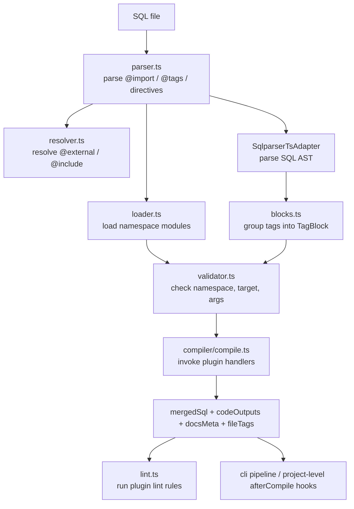

# Core Compiler

- Paths covered: `packages/core`, `packages/cli/src/utils/pipeline.ts`
- Last reviewed commit: `9571d50fee5356b058cec0247aa5189272b53de6`
- Related docs: [runtime-clients.md](./runtime-clients.md), [schema-engine.md](./schema-engine.md), [namespaces.md](./namespaces.md)

`packages/core` owns the Tier 1 compiler: parse comments, resolve imports/directives, identify the tagged SQL object, validate tag usage, call namespace plugins, and build merged SQL plus metadata. The CLI pipeline then wraps that Tier 1 work with Tier 2 schema inspection.

## Module Map

| Area | Key files | What they do |
| --- | --- | --- |
| Public API | [`packages/core/src/index.ts`](../packages/core/src/index.ts) | Barrel exports for parser, compiler, config, loader, resolver, emitter, validator, lint, and types. |
| Config | [`packages/core/src/compiler/config.ts`](../packages/core/src/compiler/config.ts) | Finds `sqldoc.config.*`, loads it through `tsImport`, resolves single vs multi-project configs. |
| Comment parsing | [`packages/core/src/parser.ts`](../packages/core/src/parser.ts), [`packages/core/src/directives.ts`](../packages/core/src/directives.ts) | Extracts `@import`, `@external`, `@include`, and comment tags. |
| Module loading | [`packages/core/src/loader.ts`](../packages/core/src/loader.ts), [`packages/core/src/ts-import.ts`](../packages/core/src/ts-import.ts), [`packages/core/src/packages.ts`](../packages/core/src/packages.ts) | Resolves relative or package imports, unwraps ESM/CJS defaults, and supports auto-install hooks. |
| File graph resolution | [`packages/core/src/resolver.ts`](../packages/core/src/resolver.ts) | Builds the transitive project/include/external file graph, detects cycles, and preserves provenance. |
| Tag-to-object matching | [`packages/core/src/blocks.ts`](../packages/core/src/blocks.ts) | Groups adjacent tag comments and matches them to statements/columns by line spans. |
| Validation | [`packages/core/src/validator.ts`](../packages/core/src/validator.ts) | Checks namespace existence, tag existence, target compatibility, args, and plugin-specific `validate()` hooks. |
| Compilation | [`packages/core/src/compiler/compile.ts`](../packages/core/src/compiler/compile.ts) | Orchestrates Tier 1 and Tier 2 compile paths, builds `TagContext`, collects SQL/code/docs outputs and file tags. |
| SQL generation helpers | [`packages/core/src/sql-emitter.ts`](../packages/core/src/sql-emitter.ts) | Dialect-specific quoting, JSON helpers, timestamps, comments, autoincrement types. |
| Lint engine | [`packages/core/src/lint.ts`](../packages/core/src/lint.ts) | Collects plugin lint rules, applies config severity overrides, honors `@lint.ignore`. |

## Where Tier 1 Ends And Tier 2 Begins

Inside `packages/core`, “Tier 2” means `compile()` can accept an Atlas-style realm and use it instead of plain block resolution. The actual realm is not built inside `packages/core`; it is prepared by the CLI pipeline in [`packages/cli/src/utils/pipeline.ts`](../packages/cli/src/utils/pipeline.ts) using `packages/db` + `packages/inspector`.

Key cross-package handoff:

- `pipeline.ts` discovers files and resolves directives.
- `pipeline.ts` inspects SQL through the dev DB runner to obtain an Atlas realm.
- `compile()` receives `atlasRealm` and uses `compileWithRealm()` so plugins can see richer schema data.

That means edits to compile behavior often require reading both:

- [`packages/core/src/compiler/compile.ts`](../packages/core/src/compiler/compile.ts)
- [`packages/cli/src/utils/pipeline.ts`](../packages/cli/src/utils/pipeline.ts)

## Provenance And File Tags

Two compiler outputs matter for later stages:

- `fileTags`: per-object tag inventory used by linting, codegen, docs merge, and migration rename detection.
- `docsMeta`: plugin-provided relationships, annotations, and extra columns consumed later by `ns-docs`.

The compile pipeline also preserves file provenance:

- `project`: main schema files
- `include`: inlined SQL that should still affect codegen and migrations
- `external`: baseline schema objects that should not be modified or regenerated

## Best Tests To Read

- [`packages/core/src/__tests__/parser.test.ts`](../packages/core/src/__tests__/parser.test.ts)
- [`packages/core/src/__tests__/directives.test.ts`](../packages/core/src/__tests__/directives.test.ts)
- [`packages/core/src/__tests__/resolver.test.ts`](../packages/core/src/__tests__/resolver.test.ts)
- [`packages/core/src/__tests__/validator.test.ts`](../packages/core/src/__tests__/validator.test.ts)
- [`packages/core/src/__tests__/compiler/compile.test.ts`](../packages/core/src/__tests__/compiler/compile.test.ts)
- [`packages/core/src/__tests__/lint-rules.test.ts`](../packages/core/src/__tests__/lint-rules.test.ts)
- [`tests/__tests__/pipeline.test.ts`](../tests/__tests__/pipeline.test.ts)

## Breadcrumbs For Common Tasks

- Changing tag syntax: start with `parser.ts`, then `validator.ts`, then plugin tests.
- Changing how tags attach to tables/columns: `blocks.ts` is the entry point.
- Changing config lookup or project selection: `compiler/config.ts`.
- Changing include/external semantics: `directives.ts`, `resolver.ts`, then `pipeline.ts`.
- Changing dialect SQL snippets used by plugins: `sql-emitter.ts` and the affected namespace package.

## Update Breadcrumbs

- Revisit this doc when `packages/core/src/index.ts` exports change, when `pipeline.ts` changes the file/realm flow, or when a new output field is added to `CompilerOutput`.
- Keep the Tier 1 vs Tier 2 boundary accurate. Several files still use the “Tier 2” term differently; verify against current code before tightening wording.
