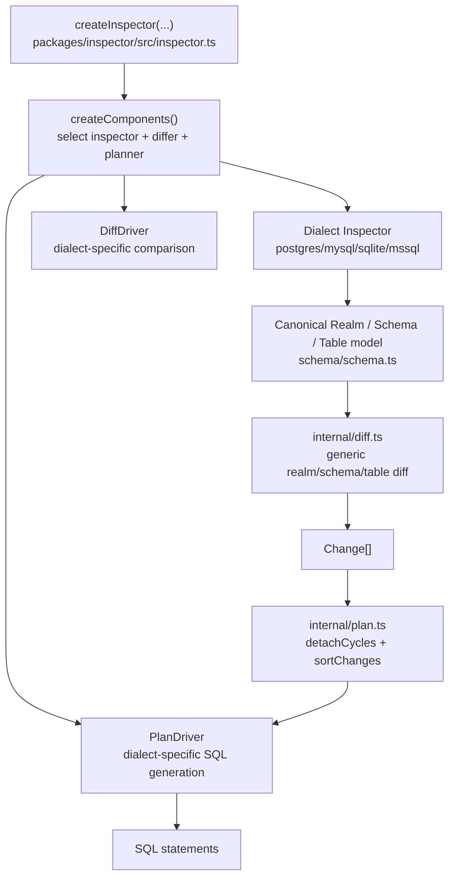

# Inspector And Dialect Authoring

- Paths covered: `packages/inspector`
- Last reviewed commit: `9571d50fee5356b058cec0247aa5189272b53de6`
- Related docs: [schema-engine.md](./schema-engine.md), [core-compiler.md](./core-compiler.md), [testing-and-fixtures.md](./testing-and-fixtures.md)

This doc is the deep dive for the inspector layer: how `inspect()` and `diff()` work, how the generic diff/planning engine is split from dialect-specific code, and what to touch when adding a new dialect family or a dialect variant.

## The Three Dialect Hooks

Every supported dialect in `packages/inspector` is assembled from three moving parts:

| Hook | Interface | What it owns | Main files |
| --- | --- | --- | --- |
| Inspector | [`Inspector`](../packages/inspector/src/schema/inspect.ts) | Query catalog state and return canonical `Realm`/`Schema` objects | `src/<dialect>/inspect.ts`, `src/<dialect>/driver.ts`, `src/<dialect>/convert.ts` |
| Differ | [`DiffDriver`](../packages/inspector/src/internal/sqlx.ts) | Decide when two canonical objects differ in a dialect-specific way | `src/<dialect>/diff.ts` |
| Planner | [`PlanDriver`](../packages/inspector/src/internal/plan.ts) | Turn canonical `Change[]` into executable DDL | `src/<dialect>/migrate.ts` |

Factory wiring lives in [`packages/inspector/src/inspector.ts`](../packages/inspector/src/inspector.ts):

- `createComponents()` picks the inspector, differ, and planner for `postgres`, `mysql`, `sqlite`, or `mssql`.
- Variants like CockroachDB, TiDB, and Azure SQL swap one or more of those components while keeping the rest.

## Canonical Schema Model

Before reading any dialect folder, read the shared model:

- [`packages/inspector/src/schema/schema.ts`](../packages/inspector/src/schema/schema.ts)
- [`packages/inspector/src/schema/inspect.ts`](../packages/inspector/src/schema/inspect.ts)
- [`packages/inspector/src/schema/migrate.ts`](../packages/inspector/src/schema/migrate.ts)

This is the contract every dialect implementation must honor:

- `Realm` contains schemas plus `defaultSchema`.
- `Schema` owns tables, views, functions, procedures, sequences, extensions, and attrs.
- `Table`/`Column`/`Index`/`ForeignKey`/`Trigger` are normalized into common TS shapes.
- `SchemaType` is a discriminated union used by diffing, planning, and templates.

If a dialect inspector emits inconsistent canonical objects, every later stage gets harder: generic diffing becomes noisy, planners need special cases, and templates/docs produce unstable output.

## How `inspect(files)` Works

`InspectorRunner.inspect()` in [`packages/inspector/src/inspector.ts`](../packages/inspector/src/inspector.ts) has two modes:

1. `inspect([])`:
   - directly introspects the attached/live database via the dialect inspector
   - filters system schemas
   - returns a `Realm`
2. `inspect(files)`:
   - snapshots the dev DB by capturing a restore function
   - executes SQL through [`packages/inspector/src/internal/dev.ts`](../packages/inspector/src/internal/dev.ts)
   - inspects the resulting database state
   - applies sqldoc tags back onto the inspected realm, because SQL execution loses comments
   - restores the dev DB to its original state

Important helper boundaries:

- `internal/dev.ts`: statement scanning, execution batching, restore handling
- `migrate/tag.ts`: extracts tags from SQL statements so they can be attached back onto `Realm` objects
- `inspector.ts`: filters system schemas and glues everything together

## How `diff(from, to)` Works

`InspectorRunner.diff()` in [`packages/inspector/src/inspector.ts`](../packages/inspector/src/inspector.ts) does this:

1. Inspect both sides into canonical `Realm` objects.
2. Optionally apply known renames to the `from` realm.
3. Detect rename candidates from drop+add pairs with matching types.
4. Call generic `realmDiff(...)` from [`internal/diff.ts`](../packages/inspector/src/internal/diff.ts), passing the dialect `DiffDriver`.
5. Call `detachCycles(...)` and `sortChanges(...)` from [`internal/plan.ts`](../packages/inspector/src/internal/plan.ts).
6. Convert each `Change` to SQL via `changeToSQL(...)` and the dialect `PlanDriver`.
7. Optionally strip the default schema qualifier from output SQL.

The split is intentional:

- `internal/diff.ts` owns traversal order and generic object matching.
- `DiffDriver` owns “what counts as changed for this dialect?”
- `PlanDriver` owns “how do I spell the DDL for this change?”

## Shared Internal Files Worth Reading

| File | Why it matters |
| --- | --- |
| [`packages/inspector/src/internal/diff.ts`](../packages/inspector/src/internal/diff.ts) | Generic realm/schema/table/view/function/procedure/sequence diff engine. |
| [`packages/inspector/src/internal/plan.ts`](../packages/inspector/src/internal/plan.ts) | Topological ordering, cycle detachment, `PlanDriver` contract, and SQL generation dispatch. |
| [`packages/inspector/src/internal/sqlx.ts`](../packages/inspector/src/internal/sqlx.ts) | Shared row-scanning helpers, `DiffDriver` contract, SQL builder, type/attr equality helpers, inspect-mode helpers. |
| [`packages/inspector/src/internal/dev.ts`](../packages/inspector/src/internal/dev.ts) | Snapshot/restore and statement execution against the dev DB. |

## Postgres As The Reference Implementation

The Postgres slice is the richest reference because it covers the widest object set.

Read in this order:

1. [`packages/inspector/src/postgres/inspect.ts`](../packages/inspector/src/postgres/inspect.ts)
2. [`packages/inspector/src/postgres/driver.ts`](../packages/inspector/src/postgres/driver.ts)
3. [`packages/inspector/src/postgres/convert.ts`](../packages/inspector/src/postgres/convert.ts)
4. [`packages/inspector/src/postgres/diff.ts`](../packages/inspector/src/postgres/diff.ts)
5. [`packages/inspector/src/postgres/migrate.ts`](../packages/inspector/src/postgres/migrate.ts)

Those files show the full pattern:

- `driver.ts`: raw catalog SQL and low-level parsing helpers
- `inspect.ts`: execute catalog SQL and assemble canonical objects
- `convert.ts`: normalize type names/defaults for equivalence
- `diff.ts`: implement dialect-specific comparison logic
- `migrate.ts`: emit DDL for `Change[]`

## Variants Inside Existing Families

Current examples:

- CockroachDB: [`packages/inspector/src/postgres/crdb.ts`](../packages/inspector/src/postgres/crdb.ts)
- TiDB: [`packages/inspector/src/mysql/tidb.ts`](../packages/inspector/src/mysql/tidb.ts)
- Azure SQL: [`packages/inspector/src/mssql/azuresql.ts`](../packages/inspector/src/mssql/azuresql.ts)

These are lighter-weight than a new dialect family:

- subclass or wrap the existing family inspector/diff/planner,
- patch the canonical model or SQL generation where that variant differs,
- wire the variant into `createComponents()` in `inspector.ts`.

If the target database is “mostly MySQL/Postgres/MSSQL but with a few quirks”, this is the cheaper path.

## How To Add A New Inspector Variant

Use the variant path if the new target database is close to an existing family.

Checklist:

1. Add a new variant file next to the family, similar to `crdb.ts` or `tidb.ts`.
2. Decide whether you need to patch:
   - inspection results,
   - diff semantics,
   - planner output,
   - or all three.
3. Wire the variant into `createComponents()` in [`packages/inspector/src/inspector.ts`](../packages/inspector/src/inspector.ts).
4. Expose a way for callers to request the variant.
   - Today that usually means a new boolean on `InspectorOptions`.
5. Add focused unit/integration tests for the variant behavior.

## How To Add A True New Dialect Family

This is bigger than `packages/inspector`.

### Inspector package work

1. Add a new dialect folder under `packages/inspector/src/<dialect>/`.
2. Implement:
   - `inspect.ts`
   - `driver.ts`
   - `convert.ts` if needed
   - `diff.ts`
   - `migrate.ts`
3. Extend the `Dialect` union and `createComponents()` in [`packages/inspector/src/inspector.ts`](../packages/inspector/src/inspector.ts).
4. Add dialect-specific statement scanning if needed in [`packages/inspector/src/internal/dev.ts`](../packages/inspector/src/internal/dev.ts).

### DB/runtime package work

1. Extend `Dialect` unions in:
   - [`packages/db/src/db/types.ts`](../packages/db/src/db/types.ts)
   - [`packages/db/src/index.ts`](../packages/db/src/index.ts)
   - [`packages/core/src/sql-emitter.ts`](../packages/core/src/sql-emitter.ts)
   - [`packages/sqldoc/src/scaffold.ts`](../packages/sqldoc/src/scaffold.ts)
2. Add or register a matching adapter plugin:
   - built-in via [`packages/db/src/db/plugin-resolver.ts`](../packages/db/src/db/plugin-resolver.ts), or
   - external `packages/db-<dialect>` package.
3. Decide the default dev URL in [`packages/db/src/index.ts`](../packages/db/src/index.ts).
4. Add default-schema handling where needed:
   - [`packages/cli/src/commands/schema.ts`](../packages/cli/src/commands/schema.ts)
   - [`packages/cli/src/utils/pipeline.ts`](../packages/cli/src/utils/pipeline.ts)
   - [`packages/cli/src/commands/migrate.ts`](../packages/cli/src/commands/migrate.ts)

### Compiler/plugin surface work

1. Add parser mapping support if `sqlparser-ts` needs a new dialect string or batching rule:
   - [`packages/core/src/ast/sqlparser-ts.ts`](../packages/core/src/ast/sqlparser-ts.ts)
2. Extend SQL helpers in [`packages/core/src/sql-emitter.ts`](../packages/core/src/sql-emitter.ts).
3. Revisit namespace packages with `databases: [...]` restrictions or dialect-specific SQL branches.
4. Revisit templates or docs generation if the canonical schema model for that dialect needs special handling.

In other words: a real new dialect is a repo-level change, not just an inspector change.

## Minimal Dialect Family Checklist

Before calling a new family “done”, verify:

- it can inspect a live DB into a stable `Realm`,
- it can inspect compiled SQL through the snapshot path,
- diffing is idempotent,
- planner output is executable against the target DB,
- default schema handling is correct,
- the CLI can choose a sensible dev URL/adapter,
- core SQL emitters and namespace plugins either support it or clearly reject it.

## Best Tests To Read Or Add

Existing references:

- [`packages/inspector/src/__tests__/postgres/inspect.test.ts`](../packages/inspector/src/__tests__/postgres/inspect.test.ts)
- [`packages/inspector/src/__tests__/mysql/inspect.test.ts`](../packages/inspector/src/__tests__/mysql/inspect.test.ts)
- [`packages/inspector/src/__tests__/sqlite/inspect.test.ts`](../packages/inspector/src/__tests__/sqlite/inspect.test.ts)
- [`packages/inspector/src/__tests__/mssql/inspect.test.ts`](../packages/inspector/src/__tests__/mssql/inspect.test.ts)
- [`packages/inspector/src/__tests__/unit/postgres-diff.test.ts`](../packages/inspector/src/__tests__/unit/postgres-diff.test.ts)
- [`packages/inspector/src/__tests__/unit/mysql-driver.test.ts`](../packages/inspector/src/__tests__/unit/mysql-driver.test.ts)
- [`packages/inspector/src/__tests__/snapshot-comparison.test.ts`](../packages/inspector/src/__tests__/snapshot-comparison.test.ts)

For a new family, add:

- one inspect integration test,
- one diff/planner unit test for a non-trivial change,
- one end-to-end CLI or fixture-level smoke test if the dialect becomes user-facing.

## Breadcrumbs For Editing

- If inspection shape is wrong: start in `src/<dialect>/inspect.ts`, then `driver.ts`, then shared schema types.
- If diffs are noisy or unstable: `src/<dialect>/diff.ts`, then `internal/diff.ts`.
- If SQL output ordering is wrong: `internal/plan.ts`, then `src/<dialect>/migrate.ts`.
- If snapshot behavior is wrong: `internal/dev.ts`.
- If the repo still rejects the new dialect after inspector work: search all `Dialect = 'postgres' | 'mysql' | 'sqlite' | 'mssql'` unions across the repo.

## Update Breadcrumbs

- Revisit this doc when `createComponents()` changes, when a new variant is added, or when the `Dialect` union changes anywhere in the repo.
- Keep the “variant vs new family” distinction explicit; they have very different implementation costs.
