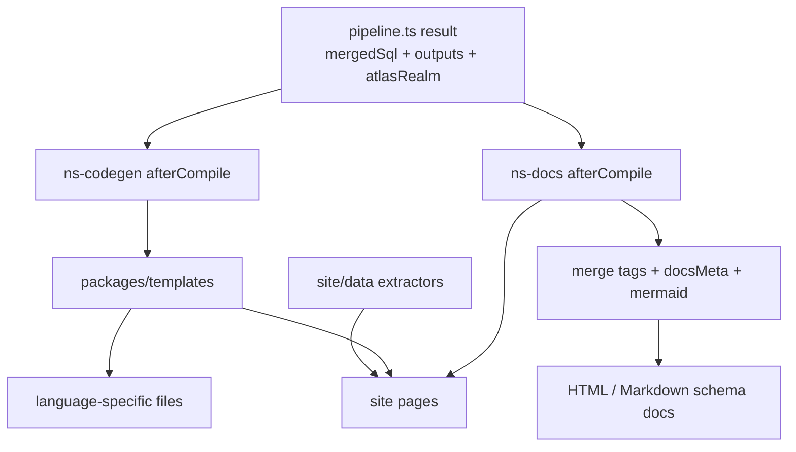

# Project Output And Templates

- Paths covered: `packages/ns-codegen`, `packages/ns-docs`, `packages/templates`, `site/data`
- Last reviewed commit: `9571d50fee5356b058cec0247aa5189272b53de6`
- Related docs: [core-compiler.md](./core-compiler.md), [schema-engine.md](./schema-engine.md), [site-and-release.md](./site-and-release.md)

This layer consumes the fully compiled project view: merged SQL, `allFileTags`, `docsMeta`, and the inspected Atlas-style realm. It produces user-visible files rather than more SQL inside the same source file.

## `ns-codegen`

| File | Role |
| --- | --- |
| [`packages/ns-codegen/src/index.ts`](../packages/ns-codegen/src/index.ts) | Loads template modules, builds `TemplateContext`, and writes template output files. |
| [`packages/ns-codegen/src/types.ts`](../packages/ns-codegen/src/types.ts) | Defines the template interface and helper types shared with `packages/templates`. |

Important behavior:

- Accepts templates either as direct objects or import strings.
- Resolves imports from the project root in monorepo mode or `.sqldoc/node_modules` in normal mode.
- Uses the inspected realm, `allFileTags`, and `docsMeta`, not just raw SQL.
- Supports `codegen.skipExternal` filtering via the CLI pipeline.

## `ns-docs`

| File | Role |
| --- | --- |
| [`packages/ns-docs/src/index.ts`](../packages/ns-docs/src/index.ts) | Project-level plugin entry. Requires an Atlas realm and writes HTML or Markdown. |
| [`packages/ns-docs/src/atlas.ts`](../packages/ns-docs/src/atlas.ts) | Converts inspector `Realm` data into the simplified docs schema model. |
| [`packages/ns-docs/src/merge.ts`](../packages/ns-docs/src/merge.ts) | Joins Atlas schema, compiler file tags, generated-object detection, docs metadata, and extra columns/annotations. |
| [`packages/ns-docs/src/mermaid.ts`](../packages/ns-docs/src/mermaid.ts) | Builds ERD output for renderers. |
| [`packages/ns-docs/src/renderers/html.ts`](../packages/ns-docs/src/renderers/html.ts), [`markdown.ts`](../packages/ns-docs/src/renderers/markdown.ts) | Render final docs. |

The most important tag here is `@docs.previously`, because `migrate.ts` also reads it later to treat table/column renames as renames instead of drop+create pairs.

## `packages/templates`

The templates package is a library of `defineTemplate(...)` exports used by `ns-codegen`. The main reusable logic lives in helpers, not in the individual language folders.

Core helper files:

- [`packages/templates/src/index.ts`](../packages/templates/src/index.ts): barrel exports
- [`packages/templates/src/helpers/atlas.ts`](../packages/templates/src/helpers/atlas.ts): realm walking and tag lookup helpers
- [`packages/templates/src/helpers/enrich.ts`](../packages/templates/src/helpers/enrich.ts): computes `EnrichedSchema`, relationships, naming, type overrides, skip flags
- [`packages/templates/src/helpers/naming.ts`](../packages/templates/src/helpers/naming.ts): case conversion and schema-aware naming
- [`packages/templates/src/helpers/tags.ts`](../packages/templates/src/helpers/tags.ts): reads `@codegen.*` tags
- [`packages/templates/src/types`](../packages/templates/src/types): Postgres-to-language type mappers
- [`packages/templates/src/tags`](../packages/templates/src/tags): tagged-template helpers such as `dedent`

Exported template folders currently present in `packages/templates/package.json`:

- `typescript`
- `zod`
- `drizzle`
- `prisma`
- `kysely`
- `knex`
- `go-structs`
- `gorm`
- `sqlc`
- `python-dataclasses`
- `sqlalchemy`
- `pydantic`
- `java-records`
- `jpa`
- `kotlin-data`
- `rust-structs`
- `diesel`
- `csharp-records`
- `efcore`
- `json-schema`
- `xsd`
- `protobuf`
- `cobol-copybook`
- `ruby-activerecord`
- `php-eloquent`
- `swift-codable`
- `typeorm`

Good exemplar files to read:

- [`packages/templates/src/typescript/index.ts`](../packages/templates/src/typescript/index.ts)
- [`packages/templates/src/drizzle/index.ts`](../packages/templates/src/drizzle/index.ts)
- [`packages/templates/src/sqlalchemy/index.ts`](../packages/templates/src/sqlalchemy/index.ts)
- [`packages/templates/src/typeorm/index.ts`](../packages/templates/src/typeorm/index.ts)

Representative tests:

- [`packages/templates/src/__tests__/typescript.test.ts`](../packages/templates/src/__tests__/typescript.test.ts)
- [`packages/templates/src/__tests__/multi-schema-templates.test.ts`](../packages/templates/src/__tests__/multi-schema-templates.test.ts)
- [`packages/templates/src/__tests__/enrich-multi-schema.test.ts`](../packages/templates/src/__tests__/enrich-multi-schema.test.ts)
- [`packages/templates/src/__tests__/type-mapping.test.ts`](../packages/templates/src/__tests__/type-mapping.test.ts)

## `site/data`

The site uses source-text extraction instead of importing workspace packages directly. That is important when updating metadata or docs-generation behavior.

| File | Role |
| --- | --- |
| [`site/data/extract-plugins.ts`](../site/data/extract-plugins.ts) | Parses `packages/ns-*` source text and extracts tag/lint metadata for the docs site. |
| [`site/data/extract-templates.ts`](../site/data/extract-templates.ts) | Walks template folders and extracts `defineTemplate(...)` metadata. |
| [`site/data/generate-cli-reference.ts`](../site/data/generate-cli-reference.ts) | Builds CLI reference pages. |
| [`site/data/generate-homepage-example.ts`](../site/data/generate-homepage-example.ts) | Regenerates homepage example output. |

Note that `extract-templates.ts` excludes helper folders and currently skips `typeorm` in its directory allowlist. If site docs and package exports disagree, check this extractor first.

## Breadcrumbs For Output Bugs

- Wrong generated naming or relationship metadata: start at `helpers/enrich.ts`.
- Wrong docs HTML/Markdown content: `ns-docs/src/merge.ts`, then the renderer.
- Template discovery/import failure: `ns-codegen/src/index.ts`.
- Site docs out of sync with source: `site/data/extract-plugins.ts` or `extract-templates.ts`.

## Update Breadcrumbs

- Revisit this doc when new template folders are exported, when the template helper interfaces change, or when `ns-docs` / `ns-codegen` add new context fields.
- Keep the template export list aligned with `packages/templates/package.json`, not just the site extractor.
