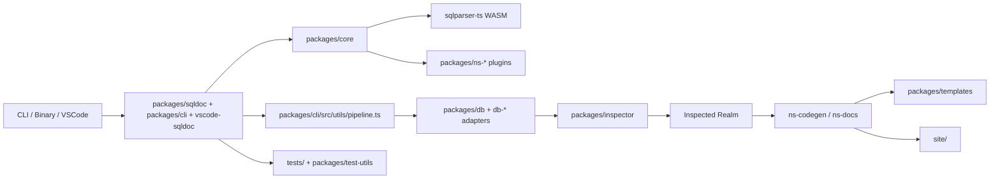

# Repo Overview

- Paths covered: `.`, `README.md`, `package.json`, `CHANGELOG.md`, `CLAUDE.md`, `dev-docs`
- Last reviewed commit: `fe6b77e71474cabfa8f22d30520ff33ac951b90c`
- Use this doc first, then drill into [development.md](./development.md), [runtime-clients.md](./runtime-clients.md), [core-compiler.md](./core-compiler.md), [schema-engine.md](./schema-engine.md), [inspector-dialects.md](./inspector-dialects.md), [namespaces.md](./namespaces.md), [project-output.md](./project-output.md), [testing-and-fixtures.md](./testing-and-fixtures.md), and [site-and-release.md](./site-and-release.md).

sqldoc is a TypeScript monorepo built around one idea: SQL files stay the source of truth, and tagged comments compile into extra SQL, docs, typed code, lint diagnostics, and migrations. The repo is split into a thin user-facing runtime layer, a compiler core, a schema-inspection engine, namespace plugins, output/rendering packages, and a large fixture-heavy test suite.

## Top-Level Layout

| Area | Purpose | Start here |
| --- | --- | --- |
| Runtime clients | Global shim, project-local CLI, VSCode validation | [`packages/sqldoc/src/index.ts`](../packages/sqldoc/src/index.ts), [`packages/cli/src/index.ts`](../packages/cli/src/index.ts), [`vscode-sqldoc/src/extension.ts`](../vscode-sqldoc/src/extension.ts) |
| Compiler core | Parse tags/imports, resolve directives, validate, compile plugin SQL/code metadata | [`packages/core/src/index.ts`](../packages/core/src/index.ts), [`packages/core/src/compiler/compile.ts`](../packages/core/src/compiler/compile.ts) |
| Schema engine | Choose dev DB adapter, inspect/diff schema, generate migration plans | [`packages/db/src/index.ts`](../packages/db/src/index.ts), [`packages/inspector/src/inspector.ts`](../packages/inspector/src/inspector.ts) |
| Namespace plugins | Tag semantics for audit, docs, codegen, RLS, validation, etc. | [`packages/ns-audit/src/index.ts`](../packages/ns-audit/src/index.ts), [`packages/ns-docs/src/index.ts`](../packages/ns-docs/src/index.ts) |
| Output templates | Turn inspected schema into language-specific files | [`packages/templates/src/index.ts`](../packages/templates/src/index.ts), [`packages/templates/src/helpers/enrich.ts`](../packages/templates/src/helpers/enrich.ts) |
| Tests and fixtures | End-to-end proof across dialects and workflows | [`tests/__tests__/workflows/cli-workflows.test.ts`](../tests/__tests__/workflows/cli-workflows.test.ts), [`tests/pet-store-postgres/pet-store.test.ts`](../tests/pet-store-postgres/pet-store.test.ts) |
| Site and release tooling | Extract metadata from source, build docs site, publish binary/npm releases | [`site/package.json`](../site/package.json), [`site/data/extract-plugins.ts`](../site/data/extract-plugins.ts), [`scripts/release.sh`](../scripts/release.sh) |

## Package Families

| Family | Members | Notes |
| --- | --- | --- |
| Core runtime | `packages/sqldoc`, `packages/cli`, `vscode-sqldoc` | User entry points. `sqldoc` delegates to project-local `@sqldoc/cli`. |
| Compiler | `packages/core` | Pure TS layer for parsing, validation, compilation, config loading, lint engine. |
| Schema adapters | `packages/db`, `packages/db-postgres`, `packages/db-mysql`, `packages/db-mssql`, `packages/db-pglite`, `packages/db-neon`, `packages/db-neon-temporary` | Runtime selection of connection strategy based on `devUrl`. |
| Schema inspection | `packages/inspector`, `sqlparser-ts` | `inspector` is the TypeScript schema engine. `sqlparser-ts` is Rust/WASM SQL AST parsing. |
| Namespace plugins | `packages/ns-anon`, `ns-audit`, `ns-codegen`, `ns-comment`, `ns-deprecated`, `ns-docs`, `ns-history`, `ns-lint`, `ns-postgraphile`, `ns-rls`, `ns-softdelete`, `ns-temporal`, `ns-validate` | Active plugin packages with tests and published package manifests. |
| Output/templates | `packages/templates`, `site/data` | Templates and site extractors both treat source code as metadata. |
| Test support | `packages/test-utils`, `tests` | Helpers plus committed integration fixtures/golden outputs. |

## Best Next Reads

- For local workflow, checks, and how to run tests: [development.md](./development.md)
- For command behavior and delegation: [runtime-clients.md](./runtime-clients.md)
- For compile-time data flow inside one SQL file: [core-compiler.md](./core-compiler.md)
- For dev DB / inspect / diff / migration internals: [schema-engine.md](./schema-engine.md)
- For inspector internals and how to add dialects or variants: [inspector-dialects.md](./inspector-dialects.md)
- For tag semantics: [namespaces.md](./namespaces.md)
- For docs/codegen/template output: [project-output.md](./project-output.md)
- For trustworthy examples and regression coverage: [testing-and-fixtures.md](./testing-and-fixtures.md)

## Update Breadcrumbs

- Revisit this doc when `package.json` workspaces change, when a new top-level directory appears, or when an active `packages/*` package is added or removed.
- Re-run a package inventory when new active `ns-*`, `db-*`, or template directories appear.
- Keep [file-index.md](./file-index.md) aligned with this overview and with any new docs in `dev-docs/`.
