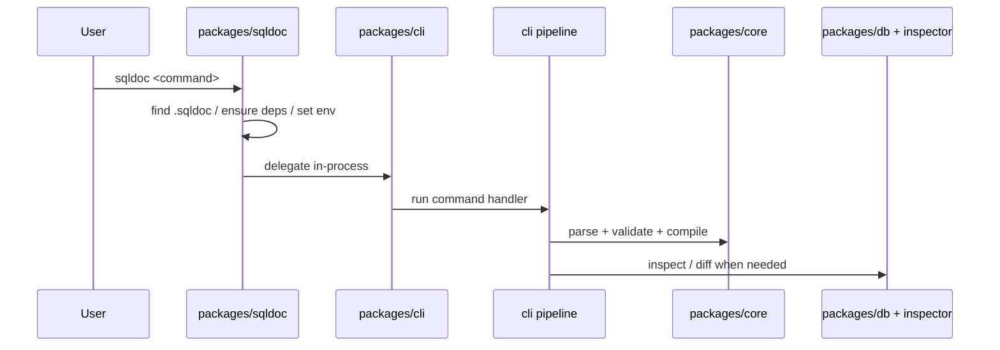

# Runtime Clients

- Paths covered: `packages/sqldoc`, `packages/cli`, `vscode-sqldoc`
- Last reviewed commit: `9571d50fee5356b058cec0247aa5189272b53de6`
- Related docs: [repo-overview.md](./repo-overview.md), [core-compiler.md](./core-compiler.md), [schema-engine.md](./schema-engine.md)

This layer is the user-facing shell around the compiler. It handles project bootstrap, dependency installation, command parsing, workspace traversal, and editor integration. It does not own the tag semantics; it wires the user into `packages/core` and the schema pipeline.

## `packages/sqldoc`

| Concern | Key files | What to know |
| --- | --- | --- |
| Global shim entry | [`packages/sqldoc/src/index.ts`](../packages/sqldoc/src/index.ts) | Dispatches built-in `init`, `add`, `upgrade`, otherwise delegates to the project-local CLI in `.sqldoc/node_modules`. |
| Delegation | [`packages/sqldoc/src/delegate.ts`](../packages/sqldoc/src/delegate.ts) | Loads `@sqldoc/core` and `@sqldoc/cli` from the project-local install, enables TS stripping under `node_modules`, shares the package-installer hook, and rewrites `process.argv`. |
| Bootstrap | [`packages/sqldoc/src/commands/init.ts`](../packages/sqldoc/src/commands/init.ts) | Creates `.sqldoc/`, writes `.gitignore`, installs or symlinks workspace packages, and scaffolds `sqldoc.config.ts`. |
| Package management | [`packages/sqldoc/src/commands/add.ts`](../packages/sqldoc/src/commands/add.ts), [`packages/sqldoc/src/commands/upgrade.ts`](../packages/sqldoc/src/commands/upgrade.ts), [`packages/sqldoc/src/arborist.ts`](../packages/sqldoc/src/arborist.ts) | Manages the local package sandbox the CLI runs from. |

Important tests:

- [`packages/sqldoc/src/__tests__/init.test.ts`](../packages/sqldoc/src/__tests__/init.test.ts)
- [`packages/sqldoc/src/__tests__/find-sqldoc.test.ts`](../packages/sqldoc/src/__tests__/find-sqldoc.test.ts)
- [`packages/sqldoc/src/__tests__/generate-config-types.test.ts`](../packages/sqldoc/src/__tests__/generate-config-types.test.ts)

## `packages/cli`

The CLI is intentionally thin: each command resolves config/project selection, then calls shared helpers in `packages/core`, `packages/db`, and `packages/cli/src/utils/pipeline.ts`.

| Command | Handler | Notes |
| --- | --- | --- |
| `compile` | [`packages/cli/src/commands/compile.ts`](../packages/cli/src/commands/compile.ts) | Runs the shared compile pipeline and writes merged SQL. |
| `codegen` | [`packages/cli/src/commands/codegen.ts`](../packages/cli/src/commands/codegen.ts) | Re-runs inspection when generated SQL changes the schema, then executes project-level plugin hooks such as `ns-codegen` and `ns-docs`. |
| `validate` | [`packages/cli/src/commands/validate.ts`](../packages/cli/src/commands/validate.ts) | Uses `core.parse`, `core.loadImports`, `core.validate`, and optional auto-install. |
| `lint` | [`packages/cli/src/commands/lint.ts`](../packages/cli/src/commands/lint.ts) | Compiles first, then runs `core.lint` over loaded plugins and file tags. |
| `schema inspect` / `schema diff` | [`packages/cli/src/commands/schema.ts`](../packages/cli/src/commands/schema.ts) | Either inspect compiled SQL or live DB URLs, with external-object cancellation for diffs. |
| `migrate` | [`packages/cli/src/commands/migrate.ts`](../packages/cli/src/commands/migrate.ts) | Diff migrations vs desired schema, detect rename candidates, block destructive changes unless `--force`, and write migration files. |
| `doctor` | [`packages/cli/src/commands/doctor.ts`](../packages/cli/src/commands/doctor.ts) | Checks `.sqldoc`, dependencies, `atlas.wasm`, and config parseability. |

Shared helpers worth reading before editing command behavior:

- [`packages/cli/src/index.ts`](../packages/cli/src/index.ts): Commander wiring and `--all` workspace wrapper.
- [`packages/cli/src/utils/auto-install.ts`](../packages/cli/src/utils/auto-install.ts): prompt/install/retry logic for missing plugins and adapters.
- [`packages/cli/src/utils/workspace.ts`](../packages/cli/src/utils/workspace.ts): finds all `sqldoc.config.*` files with `git ls-files`.
- [`packages/cli/src/utils/pipeline.ts`](../packages/cli/src/utils/pipeline.ts): the real compile pipeline shared by multiple commands. Its detailed flow is documented in [core-compiler.md](./core-compiler.md).

Important tests:

- [`packages/cli/src/__tests__/codegen.test.ts`](../packages/cli/src/__tests__/codegen.test.ts)
- [`packages/cli/src/__tests__/migrations.test.ts`](../packages/cli/src/__tests__/migrations.test.ts)
- [`packages/cli/src/__tests__/rename-detection.test.ts`](../packages/cli/src/__tests__/rename-detection.test.ts)
- [`tests/__tests__/workflows/cli-workflows.test.ts`](../tests/__tests__/workflows/cli-workflows.test.ts)

## `vscode-sqldoc`

| File | Role |
| --- | --- |
| [`vscode-sqldoc/src/extension.ts`](../vscode-sqldoc/src/extension.ts) | Reuses `@sqldoc/core` parse/load/validate logic to provide diagnostics, hover, completion, and document links in SQL editors. |
| [`vscode-sqldoc/build.mjs`](../vscode-sqldoc/build.mjs) | Bundles the extension with esbuild. |

The extension does not run the full schema-inspection pipeline. It stays in the Tier 1 world: parse comments, load namespaces, parse SQL AST via `SqlparserTsAdapter`, and surface validation diagnostics. That makes it the quickest place to understand the “editor-safe” subset of the architecture.

## Update Breadcrumbs

- Revisit this doc when CLI commands are added, removed, or renamed.
- If `.sqldoc` bootstrap behavior changes, re-read `packages/sqldoc/src/index.ts`, `delegate.ts`, and `commands/init.ts`.
- If editor behavior changes, compare `vscode-sqldoc/src/extension.ts` against `packages/core` parsing/validation APIs so the docs do not imply capabilities the extension does not have.
