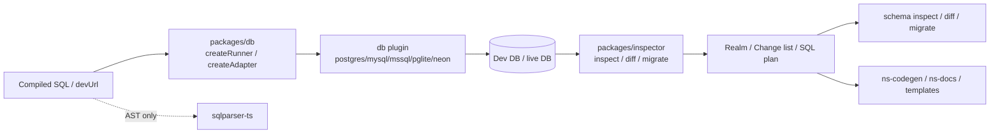

# Schema Engine

- Paths covered: `packages/db`, `packages/db-*`, `packages/inspector`, `sqlparser-ts`
- Last reviewed commit: `9571d50fee5356b058cec0247aa5189272b53de6`
- Related docs: [core-compiler.md](./core-compiler.md), [inspector-dialects.md](./inspector-dialects.md), [project-output.md](./project-output.md), [testing-and-fixtures.md](./testing-and-fixtures.md)

This layer turns SQL or live database URLs into inspectable schema state. `packages/db` decides how to connect to a dev database. `packages/inspector` executes SQL, inspects catalog state, computes diffs, and emits migration plans. `sqlparser-ts` is separate: it supports AST parsing for the compiler and editor, not runtime schema inspection. For the deeper inspector breakdown and the dialect-authoring path, use [inspector-dialects.md](./inspector-dialects.md).

## `packages/db`

| File | Role |
| --- | --- |
| [`packages/db/src/index.ts`](../packages/db/src/index.ts) | Public facade. Exports `createAdapter`, `createDbSource`, and `createRunner`. Chooses the right DbSource flavour based on devUrl scheme. |
| [`packages/db/src/db/plugin-resolver.ts`](../packages/db/src/db/plugin-resolver.ts) | Resolves built-in or external adapter plugins by URL scheme, with optional automatic installation. |
| [`packages/db/src/db/dbsource-memory.ts`](../packages/db/src/db/dbsource-memory.ts) | In-memory DbSource (pglite, sqlite). Each `open()` calls the plugin resolver for a fresh adapter. |
| [`packages/db/src/db/dbsource-server.ts`](../packages/db/src/db/dbsource-server.ts) | Server DbSource for `postgres://` / `mysql://` / `mssql://` URLs. Opens an admin connection and creates/drops a shadow database per `open()`. Rejects URLs that include a database path — we never touch a real DB. |
| [`packages/db/src/db/dbsource-container.ts`](../packages/db/src/db/dbsource-container.ts) | Container DbSource for `docker://` / `dockerfile://` URLs. Starts the container once (reused across invocations by default), then creates shadow DBs inside it. |
| [`packages/db/src/db/shadow-sql.ts`](../packages/db/src/db/shadow-sql.ts) | Per-dialect helpers: `CREATE/DROP DATABASE`, URL rewriting, stale-shadow cleanup (`sqldoc_shadow_*` databases older than 10 s with no active connections). |
| [`packages/db/src/db/docker.ts`](../packages/db/src/db/docker.ts) | Low-level Docker CLI wrappers (start container, build from Dockerfile, stale container cleanup). |
| [`packages/db/src/db/sqlite.ts`](../packages/db/src/db/sqlite.ts) | Built-in SQLite adapter. |
| [`packages/db/src/extensions.ts`](../packages/db/src/extensions.ts) | Extracts and validates PostgreSQL extension requirements against the dev DB. |

### DbSource Model

The inspector consumes a `DbSource` — a factory that hands out fresh, isolated `DatabaseAdapter` instances on demand (`open()` returns a new one; closing the adapter disposes it; `source.close()` tears down long-lived resources like an admin connection or container). The three concrete flavours match the three ways a project supplies a dev DB:

- **Memory** (pglite / sqlite) — each `open()` spins up a new in-memory instance. No container, no network.
- **Server** (user-provided URL) — we open an admin connection to the server's maintenance DB (`postgres` / `mysql` / `master`) and `CREATE DATABASE sqldoc_shadow_*` per `open()`. The credentials must have CREATE DATABASE permission (Postgres `CREATEDB`, MySQL `CREATE/DROP on *.*`, MSSQL `dbcreator`). The URL must *not* include a database path, enforcing that we never CREATE/DROP inside an existing application DB.
- **Container** (`docker://` / `dockerfile://`) — we start a container once, connect an admin, and then behave like the server flavour inside the container. Reuse defaults to true, so subsequent sqldoc runs reconnect to the same container (no ~30 s cold start).

Each operation gets its own shadow database, so `diff()` runs the two introspections in parallel (`Promise.all`) with no cross-contamination. When a source starts up, it also drops any `sqldoc_shadow_*` databases on the server that are idle *and* older than the 10 s stale threshold — this cleans up crashed processes without touching active parallel work.

The important design choice: every adapter, regardless of flavour, goes through the same plugin contract. `schema.ts`, `migrate.ts`, and the compile pipeline don't need to know whether the dev DB came from pglite, a container, or a remote server.

## Adapter Packages

| Package | Key file | Notes |
| --- | --- | --- |
| `packages/db-postgres` | [`packages/db-postgres/src/index.ts`](../packages/db-postgres/src/index.ts) | `postgres.js` adapter; detects current schema on connect. |
| `packages/db-mysql` | [`packages/db-mysql/src/index.ts`](../packages/db-mysql/src/index.ts) | `mysql2/promise` adapter. |
| `packages/db-mssql` | [`packages/db-mssql/src/index.ts`](../packages/db-mssql/src/index.ts) | `mssql` adapter with `GO` batch splitting and `?` -> `@pN` binding. |
| `packages/db-pglite` | [`packages/db-pglite/src/index.ts`](../packages/db-pglite/src/index.ts) | Default zero-config Postgres dev DB using PGlite plus extension module loading. |
| `packages/db-neon` | [`packages/db-neon/src/index.ts`](../packages/db-neon/src/index.ts) | Connects to existing Neon databases for live diff/inspect use cases. |
| `packages/db-neon-temporary` | [`packages/db-neon-temporary/src/index.ts`](../packages/db-neon-temporary/src/index.ts) | Creates and caches a temporary Neon database for 72 hours, uses advisory locking and schema wipe on each run. |

Best tests:

- [`packages/db/src/__tests__/plugin-resolver.test.ts`](../packages/db/src/__tests__/plugin-resolver.test.ts)
- [`packages/db/src/__tests__/docker.test.ts`](../packages/db/src/__tests__/docker.test.ts)
- [`packages/db/src/__tests__/mysql-docker.test.ts`](../packages/db/src/__tests__/mysql-docker.test.ts)
- [`packages/db-neon-temporary/src/__tests__/neon-temporary.test.ts`](../packages/db-neon-temporary/src/__tests__/neon-temporary.test.ts)

## `packages/inspector`

`packages/inspector` is the engine that owns schema introspection, diffing, and SQL planning. Read it when the question is “what does the database schema look like?” or “why did a migration diff come out this way?” If the question is “how is the inspector put together?” or “how do I add a new dialect?”, jump to [inspector-dialects.md](./inspector-dialects.md).

| Area | Key files | Notes |
| --- | --- | --- |
| Public runner | [`packages/inspector/src/inspector.ts`](../packages/inspector/src/inspector.ts) | Takes a `DbSource`, opens fresh adapters per operation, filters system schemas, applies extracted tags, and exposes `inspect()` / `diff()` / `close()`. `diff()` opens the two sides in parallel. |
| Internal diff/plan | [`packages/inspector/src/internal/diff.ts`](../packages/inspector/src/internal/diff.ts), [`packages/inspector/src/internal/plan.ts`](../packages/inspector/src/internal/plan.ts), [`packages/inspector/src/internal/sqlx.ts`](../packages/inspector/src/internal/sqlx.ts) | Normalizes realms, sorts changes, detaches cycles, and turns them into SQL. |
| Dialect-specific inspection | [`packages/inspector/src/postgres`](../packages/inspector/src/postgres), [`../packages/inspector/src/mysql`](../packages/inspector/src/mysql), [`../packages/inspector/src/sqlite`](../packages/inspector/src/sqlite), [`../packages/inspector/src/mssql`](../packages/inspector/src/mssql) | Each folder has `inspect.ts`, `diff.ts`, `driver.ts`, `migrate.ts`, plus variants such as Cockroach, TiDB, Azure SQL. |
| Migration helpers | [`packages/inspector/src/migrate`](../packages/inspector/src/migrate) | Statement scanning, tag extraction, migration dir abstractions. |
| Schema model | [`packages/inspector/src/schema`](../packages/inspector/src/schema) | Canonical `Realm`, `Table`, `Column`, `Change`, exclusion helpers, DSL builders. |

Representative tests:

- [`packages/inspector/src/__tests__/snapshot-comparison.test.ts`](../packages/inspector/src/__tests__/snapshot-comparison.test.ts)
- [`packages/inspector/src/__tests__/postgres/inspect.test.ts`](../packages/inspector/src/__tests__/postgres/inspect.test.ts)
- [`packages/inspector/src/__tests__/mysql/inspect.test.ts`](../packages/inspector/src/__tests__/mysql/inspect.test.ts)
- [`packages/inspector/src/__tests__/mssql/inspect.test.ts`](../packages/inspector/src/__tests__/mssql/inspect.test.ts)
- [`packages/inspector/src/__tests__/unit/postgres-diff.test.ts`](../packages/inspector/src/__tests__/unit/postgres-diff.test.ts)

## `sqlparser-ts`

`sqlparser-ts` is a separate AST parser fork living in its own workspace. It is not the schema-inspection engine. sqldoc uses it for:

- AST statement parsing in `packages/core`
- Target detection and validation support
- VSCode diagnostics/completions

Key files:

- [`sqlparser-ts/src/index.ts`](../sqlparser-ts/src/index.ts)
- [`sqlparser-ts/src/parser.ts`](../sqlparser-ts/src/parser.ts)
- [`sqlparser-ts/src/wasm.ts`](../sqlparser-ts/src/wasm.ts)
- [`sqlparser-ts/README.md`](../sqlparser-ts/README.md)

## Breadcrumbs For Common Tasks

- Adapter not loading or auto-installing: start at `packages/db/src/db/plugin-resolver.ts`.
- Docker dev DB behavior wrong: inspect `packages/db/src/db/*-docker.ts`.
- Diff ordering or rename issues: `packages/inspector/src/internal/plan.ts`, then `packages/cli/src/commands/migrate.ts`.
- Schema inspection mismatch for one dialect: go straight to the dialect folder under `packages/inspector/src/`.
- AST parse issue in validation/editor only: read `sqlparser-ts`, not `packages/inspector`.

## Update Breadcrumbs

- Revisit this doc when a new adapter package or URL scheme is added.
- Revisit when the inspector introduces new dialect folders or changes the public runner interface.
- Keep the distinction between AST parsing (`sqlparser-ts`) and schema inspection (`packages/inspector`) explicit; new contributors often conflate them.
